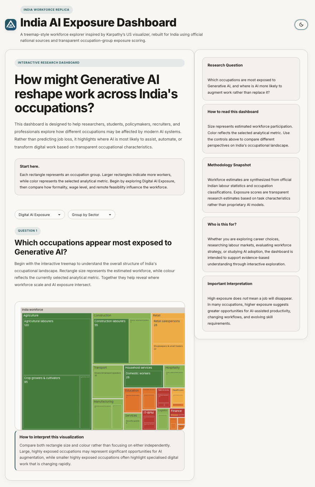
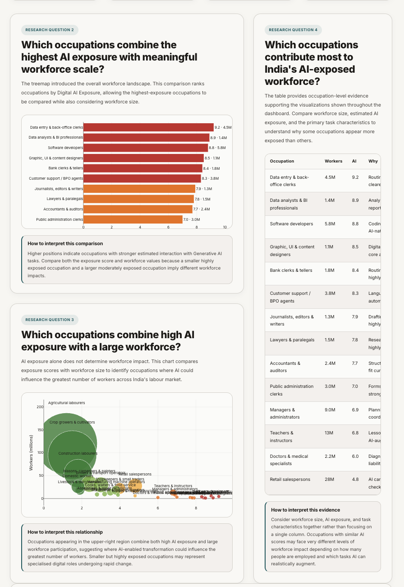
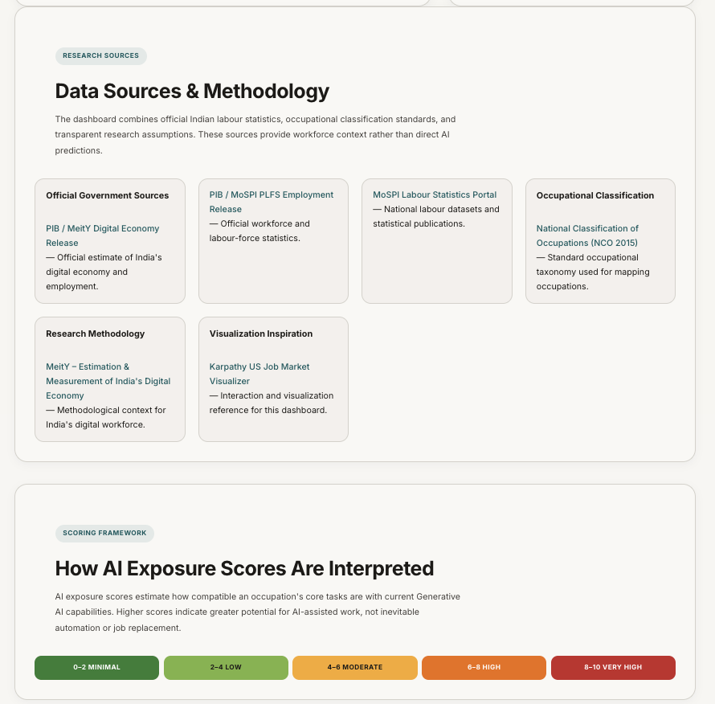
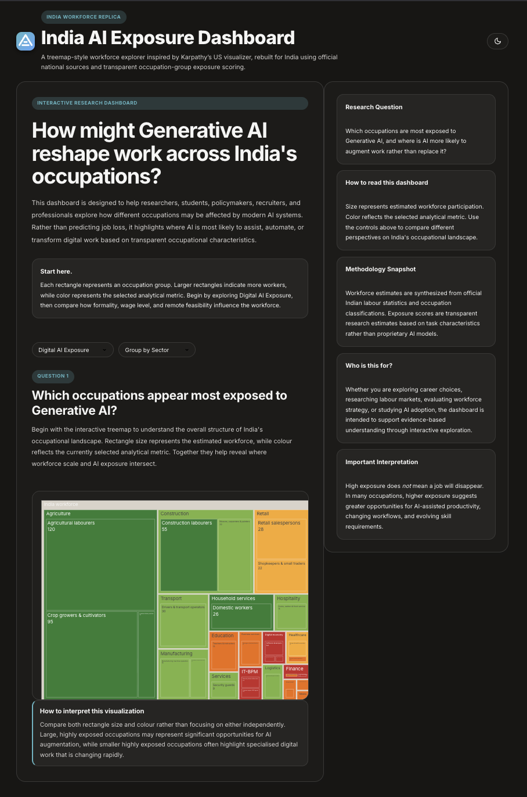

# 🇮🇳 India AI Exposure Dashboard

> **An Interactive Research Dashboard for Exploring Occupational AI Exposure Across India's Workforce**

[](https://india-ai-exposure-dashboard-v2.vercel.app)


A modern, research-driven dashboard that visualizes how Generative AI may influence different occupations across India's workforce using transparent exposure scoring, interactive analytics, and intuitive data visualization.

---

# 📊 Dashboard Preview



---

# 🌐 Live Demo

### 🚀 Explore the Dashboard

**https://india-ai-exposure-dashboard-v2.vercel.app**

---

# ✨ Why This Project?

Artificial Intelligence is reshaping the future of work, but its impact is not uniform across occupations.

The **India AI Exposure Dashboard** was created to provide an accessible and transparent way to explore how Generative AI may influence different occupational groups across India's workforce.

Rather than predicting job displacement, the dashboard focuses on understanding where AI is most likely to **assist**, **augment**, or **automate** work through research-oriented visualizations built upon publicly available data and transparent analytical assumptions.

---

# 🚀 Key Features

## 📈 Interactive Analytics

- Interactive AI Exposure Treemap
- Occupation-wise Workforce Analysis
- AI Exposure vs Workforce Distribution
- Employment Statistics Overview
- Interactive Workforce Table

## 📊 Data Visualization

- Plotly.js Interactive Charts
- KPI Summary Cards
- Treemap Visualization
- Scatter Plot Analysis
- Workforce Ranking Table

## 🎨 User Experience

- Fully Responsive Layout
- Light & Dark Theme
- Smooth Scrolling Experience
- Research-focused UI Design
- Accessible Information Architecture

## 🔬 Research Focus

- Transparent AI Exposure Methodology
- Occupation-Level Analysis
- Public Government References
- Educational & Research-Oriented Insights

---

# 🧭 Dashboard Walkthrough

The dashboard guides users through multiple research questions:

1. Dashboard Overview
2. Key Research Highlights
3. Research Question 1 — AI Exposure Treemap
4. Research Question 2 — Highest AI Exposure Occupations
5. Research Question 3 — AI Exposure vs Workforce Scale
6. Research Question 4 — Largest AI-Exposed Workforce Groups
7. Data Sources & Methodology

Each section answers a specific analytical question while maintaining a consistent visual storytelling experience.

---

# 🔍 Research Dashboard



---

# 🛠 Technology Stack

| Category | Technology |
|-----------|------------|
| Frontend | HTML5 |
| Styling | CSS3 |
| Programming | Vanilla JavaScript |
| Visualization | Plotly.js |
| Typography | Google Fonts |
| Deployment | Vercel |

---

# 📂 Project Structure

```text
India-AI-Exposure-Dashboard-v2/
│
├── assets/
│   ├── icons/
│   │   └── favicon.svg
│   │
│   └── screenshots/
│       ├── dashboard-preview.png
│       ├── research-dashboard.png
│       ├── methodology.png
│       └── dark-mode.png
│
├── index.html
├── README.md
├── LICENSE
└── .gitignore
```

---

# 📚 Data Sources

The dashboard references publicly available information from:

- Ministry of Electronics & Information Technology (MeitY)
- Ministry of Statistics & Programme Implementation (MoSPI)
- Government of India – Press Information Bureau (PIB)
- National Classification of Occupations (NCO 2015)
- Plotly.js Documentation

These sources provide workforce context rather than direct AI predictions.

---

# 🔬 Methodology

AI Exposure Scores are estimated using occupation-level characteristics including:

- Digital dependency
- Routine information processing
- Nature of work
- Current Generative AI capabilities

The methodology is intentionally transparent and designed for research, education, and discussion rather than prediction.



---

# 🌙 Dark Mode

The dashboard includes a carefully designed dark theme that preserves readability, chart clarity, and visual consistency across all interactive components.



---

# ⚠️ Disclaimer

This project is intended solely for **educational and research purposes**.

AI exposure scores presented in the dashboard are analytical estimates derived from publicly available occupational characteristics.

They **should not** be interpreted as:

- Official Government rankings
- Employment forecasts
- Predictions of job replacement
- Labour market policy recommendations

---

# 🙏 Acknowledgements

This project was inspired by **Andrej Karpathy's US Job Market Visualizer**.

The concept has been independently reinterpreted and rebuilt for India's workforce using publicly available Indian labour statistics, occupational classification standards, and a transparent AI exposure methodology.

---

# ▶️ Running the Project

Clone the repository:

```bash
git clone https://github.com/zavil-huda/India-AI-Exposure-Dashboard-v2.git
```

Navigate into the project:

```bash
cd India-AI-Exposure-Dashboard-v2
```

Open:

```text
index.html
```

Or launch the project using **Live Server** in Visual Studio Code.

---

# 🗺 Roadmap

## ✅ Completed

- Interactive Dashboard
- Production Deployment (Vercel)
- Research Methodology
- Responsive Layout
- Dark Mode
- Plotly.js Visualizations
- Code Cleanup & Optimization
- Production-ready UI

## 🔜 Future Enhancements

- Occupation Search
- Advanced Filtering
- Additional Labour Datasets
- Export & Sharing
- Accessibility Improvements
- Performance Optimizations

---

# 👨‍💻 Author

## Zavil Huda Quraishi

**UI/UX Designer • Digital Experience Designer • AI Enthusiast**

Passionate about crafting intuitive digital experiences, building research-driven products, and exploring the intersection of Artificial Intelligence, workforce analytics, and data visualization.

### Connect with me

- **GitHub:** https://github.com/zavil-huda
- **LinkedIn:** https://www.linkedin.com/in/zavil-huda-quraishi

---

# 📄 License

This project is licensed under the **MIT License**.

See the **LICENSE** file for complete details.